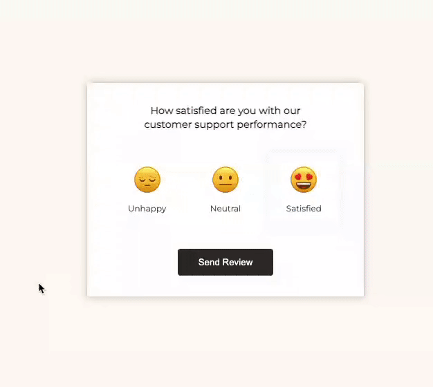

# Feedback UI Design 🔥

The **Feedback UI Design** project is a simple and interactive web interface built using HTML, CSS, JavaScript, and Font Awesome icons. It provides users with the ability to submit their feedback about customer support performance. Users can select their satisfaction level and submit their feedback, which will then be used to enhance the customer support experience.

[Deployed Link Here](https://iqbalahmadi.github.io/Feedback-UI-Design/)  

## Features

- Display a user-friendly interface for collecting feedback on customer support performance.
- Three satisfaction levels to choose from: Unhappy, Neutral, and Satisfied.
- Utilizes Font Awesome icons to enhance the visual representation.
- Dynamic transition between the initial message card and the feedback submission confirmation card.

## How to Use

1. Open the `index.html` file in your preferred web browser.

2. You will see a card with the message "How satisfied are you with our customer support performance?" and three choices: Unhappy, Neutral, and Satisfied.

3. Click on the option that best represents your satisfaction level.

4. After selecting your choice, click the "Send Review" button.

5. You will be directed to another card with the message "Thank You!" and a section displaying the feedback you provided.
